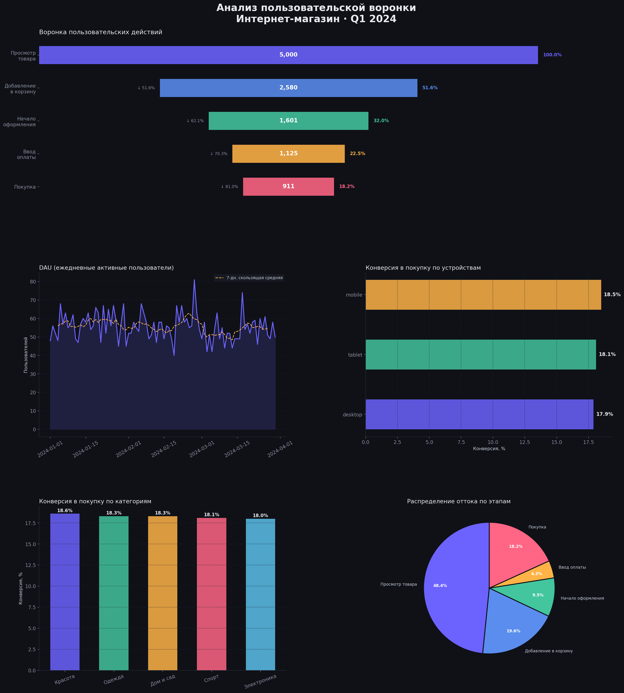

# Анализ пользовательской воронки интернет-магазина

## О проекте

Анализ пользовательского пути от просмотра товара до покупки на основе событийных данных универсального интернет-магазина (Q1 2024). Цель — выявить ключевые точки оттока и сформулировать рекомендации по повышению конверсии.

**Стек:** PostgreSQL · SQL · Python (Pandas, Matplotlib) · Tableau / Power BI

---

## Данные

| Параметр | Значение |
|----------|----------|
| Период | Январь — Март 2024 |
| Уникальных пользователей | 5 000 |
| Событий | 11 217 |
| Категории товаров | Одежда, Электроника, Дом и сад, Спорт, Красота |
| Устройства | Mobile, Desktop, Tablet |

Схема событий:
```
view_product → add_to_cart → begin_checkout → enter_payment → purchase
```

---

## Ключевые результаты

### Воронка конверсий

| Этап | Пользователей | % от начала | Конверсия шага |
|------|:---:|:---:|:---:|
| Просмотр товара | 5 000 | 100% | — |
| Добавление в корзину | 2 580 | 51.6% | 51.6% |
| Начало оформления | 1 601 | 32.0% | 62.1% |
| Ввод оплаты | 1 125 | 22.5% | 70.3% |
| Покупка | 911 | **18.2%** | 81.0% |

### Главная точка оттока

>  **48.4% пользователей уходят после просмотра товара, не добавив его в корзину** — это крупнейшая потеря в воронке.

### Конверсия по устройствам

| Устройство | Конверсия в покупку |
|-----------|:---:|
| Mobile | 18.5% |
| Desktop | 17.9% |
| Tablet | 17.1% |

Mobile-конверсия незначительно выше — при доле мобильного трафика 55% это важный канал.

### Конверсия по категориям

| Категория | Конверсия |
|-----------|:---:|
| Красота | 18.6% |
| Спорт | 18.5% |
| Электроника | 18.3% |
| Одежда | 18.0% |
| Дом и сад | 17.6% |

---

## Визуализация



---

## Рекомендации

1. **Снизить отток на этапе «просмотр → корзина» (потеря 48.4%)**
   - A/B-тест кнопки «Добавить в корзину»: изменение цвета, размера, текста
   - Добавить социальное доказательство: количество покупок, рейтинг прямо на карточке товара
   - Протестировать функцию «быстрый просмотр» без перехода на отдельную страницу

2. **Оптимизировать мобильный checkout** (55% трафика — mobile)
   - Сократить количество шагов оформления
   - Добавить Apple Pay / Google Pay для ускорения оплаты

3. **Развить категорию «Дом и сад»** — наименьшая конверсия (17.6%)
   - Провести UX-исследование: почему пользователи уходят
   - Протестировать персональные рекомендации и пакетные предложения

---

## Структура проекта

```
├── data/
│   └── events.csv              # Событийные данные
├── sql/
│   └── 01_funnel_analysis.sql  # SQL-запросы: воронка, DAU, конверсии
├── notebooks/
│   └── funnel_analysis.py      # Python-анализ и визуализации
├── funnel_dashboard.png        # Итоговый дашборд
└── README.md
```

---

## Как запустить

```bash
# Установить зависимости
pip install pandas numpy matplotlib seaborn

# Запустить анализ
python notebooks/funnel_analysis.py
```

SQL-запросы выполняются в PostgreSQL — импортируйте `data/events.csv` в таблицу `events`.
